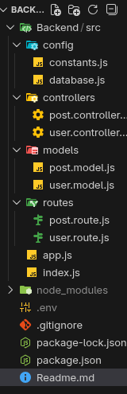

# Backend API Porject

A Node.js backend API project with authentication and post management functionality.

## 📁 Project Structure




## 🚀 Features

- User authentication and authorization
- Post creation, reading, updating, and deletion
- MongoDB database integration
- Environment-based configuration
- Modular and scalable architecture

## 📋 Prerequisites

- Node.js (v14 or higher)
- npm or yarn
- MongoDB (local or Atlas)

## 🛠️ Installation

1. Clone the repository:
   ```bash
   git clone <repository-url>
2. Install dependencies:
   ```bash

    npm install
3. Create a .env file in the root directory and add the following variables:
    env
   ```bash

    PORT=4000
    MONGODB_URI=your_mongodb_connection_string
    JWT_SECRET=your_jwt_secret_key
    NODE_ENV=development

4. Start the development server:
    ```bash

    npm run dev

🏗️ API Endpoints
User Routes

    POST /api/users/register - Register a new user

    POST /api/users/login - User login

    POST /api/users/logout - User logout
    

Post Routes

    GET /api/getPosts - Get all posts

    GET /api/posts/:id - Get a single post

    POST /api/create - Create a new post 

    PUT /api/posts/update/:id - Update a post 

    DELETE /api/posts/delete/:id - Delete a post

🔧 Configuration

The application uses different configuration files:

    constants.js - Contains application-wide constants and configuration values

    database.js - Handles MongoDB connection setup and configuration

    .env - Environment-specific variables (not committed to version control)

📦 Dependencies

Main dependencies include:

    express - Web framework

    mongoose - MongoDB ODM

    dotenv - Environment variable management

    bcryptjs - Password hashing

    nodemon

🚦 Running the Application
1. Development
   ```bash
      npm run dev

2. Production
   ```bash
      npm start

🧪 Testing
   ```bash
      npm test
```
🤝 Contributing

    Fork the repository

    Create a feature branch (git checkout -b feature/amazing-feature)

    Commit your changes (git commit -m 'Add some amazing feature')

    Push to the branch (git push origin feature/amazing-feature)

    Open a Pull Request


👥 Authors

    Parvez Alam - Initial work

🙏 Acknowledgments

    Hat tip to anyone whose code was used

    

For more information, please contact- parvezalam152977@gmail.com


This README provides:
- A clear overview of the project structure
- Installation and setup instructions
- API endpoint documentation
- Configuration details
- Dependencies list
- Development and deployment instructions
- Contributing guidelines

You can customize the content (like author name and specific endpoints, etc.) based on your actual implementation.

....

